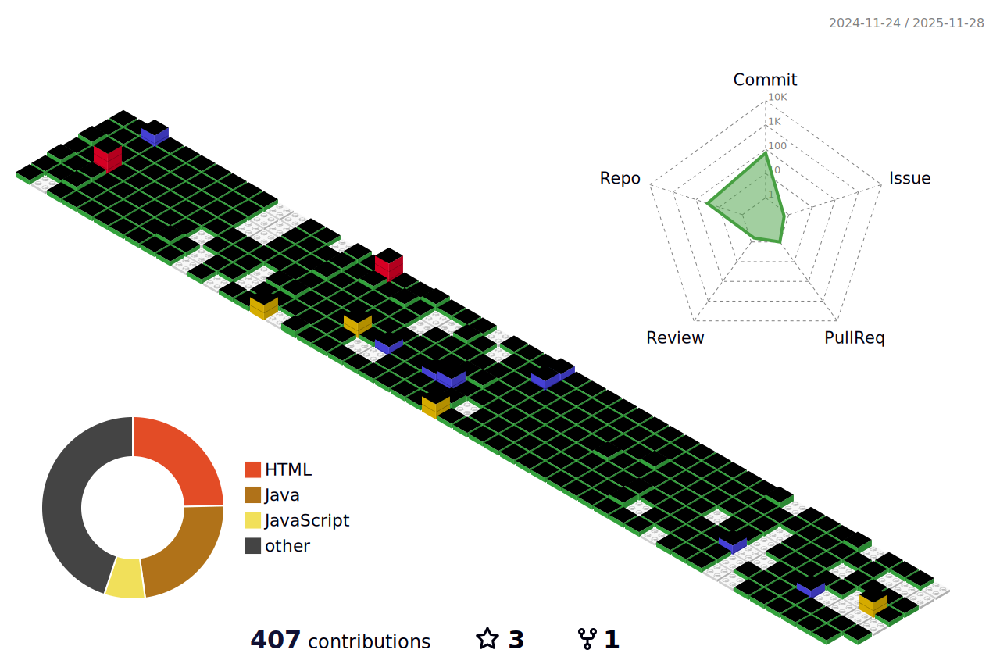

   
#
I'm Alan, a CS undergrad who works with IoT, robotics, web development, and reverse engineering. I like building small systems that connect hardware and software, and I've been exploring where blockchain might actually be useful in real applications. I tend to learn by trying things out, troubleshooting when they break, and gradually improving them. I'm always looking for projects that help me understand how things really work : )

## Socials:
   

# 💻 Tech Stack:
                             

